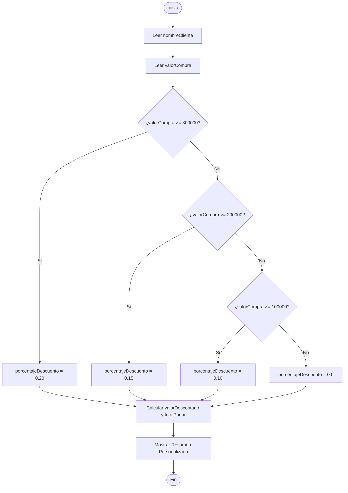

```mermaid
flowchart TD
    A([Inicio]) --> B[Leer nombreCliente]
    B --> C[Leer valorCompra]
    C --> D{"¿valorCompra >= 300000?"}
    D -->|Sí| E["porcentajeDescuento = 0.20"]
    D -->|No| F{"¿valorCompra >= 200000?"}
    F -->|Sí| G["porcentajeDescuento = 0.15"]
    F -->|No| H{"¿valorCompra >= 100000?"}
    H -->|Sí| I["porcentajeDescuento = 0.10"]
    H -->|No| J["porcentajeDescuento = 0.0"]
    E --> K["Calcular valorDescontado y totalPagar"]
    G --> K
    I --> K
    J --> K
    K --> L[Mostrar Resumen Personalizado]
    L --> M([Fin])
```

