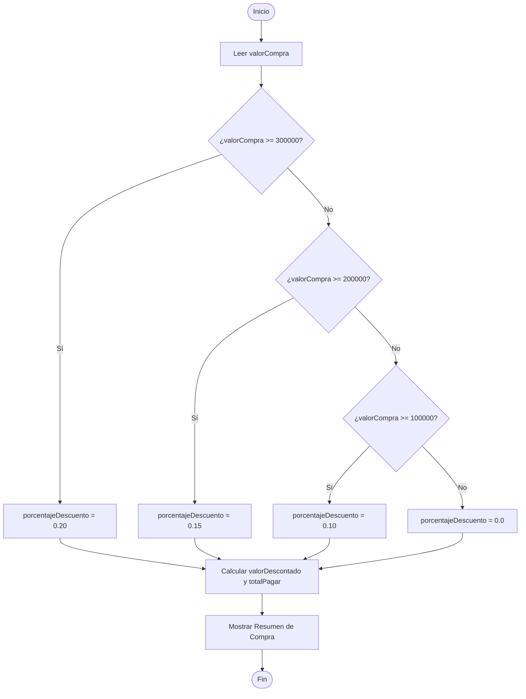

```mermaid
flowchart TD
    A([Inicio]) --> B[Leer valorCompra]
    B --> C{"¿valorCompra >= 300000?"}
    C -->|Sí| D["porcentajeDescuento = 0.20"]
    C -->|No| E{"¿valorCompra >= 200000?"}
    E -->|Sí| F["porcentajeDescuento = 0.15"]
    E -->|No| G{"¿valorCompra >= 100000?"}
    G -->|Sí| H["porcentajeDescuento = 0.10"]
    G -->|No| I["porcentajeDescuento = 0.0"]
    D --> J["Calcular valorDescontado y totalPagar"]
    F --> J
    H --> J
    I --> J
    J --> K[Mostrar Resumen de Compra]
    K --> L([Fin])
```
